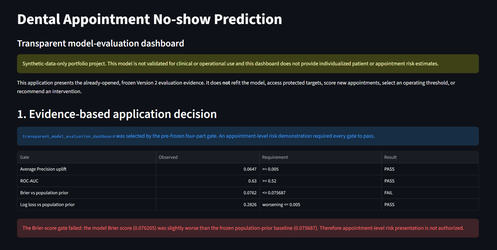
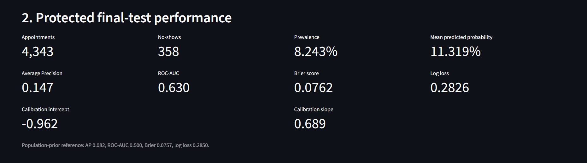

# Dental Appointment No-show Prediction

> **Synthetic-data and use disclaimer**
>
> All records in this repository are fully synthetic. They do not represent
> real patients, clinical records, or healthcare operations. This educational
> portfolio project is not validated for clinical or operational use.

## Version 2 recovery status

Version `v1.0.0` remains an immutable methodological checkpoint. The active
Version 2 recovery branch rebuilds the project as a leakage-controlled,
end-to-end Clinical AI portfolio study.

Recovery Phases R0 through R3 are complete. Phase R4 has implemented and
locally smoke-tested the evidence-based Streamlit application and assembled the
portfolio screenshots and architecture documentation. Formal R4 closeout still
requires the exact-head CI seal after this portfolio-integration batch.

The protected 2027 final test has already been accessed exactly once under the
pre-frozen R3 contract. No protected-target re-access, model refit,
recalibration, feature change, final-test threshold selection, or post-test
model tuning is permitted.

## What the project demonstrates

The Version 2 workflow includes:

- a deterministic longitudinal synthetic dental benchmark;
- strict prediction-time and label-maturity contracts;
- 32 leakage-safe prediction-time predictors;
- three-fold rolling-origin model development;
- a frozen Logistic Regression model with deterministic preprocessing;
- chronological calibration evaluation;
- pre-registered capacity and cost sensitivity analysis;
- persisted model and metadata artifacts;
- pre-test permutation-importance, error, repeat-patient, and subgroup
  diagnostics;
- a SHA-256-sealed target-free final-test probability vector;
- one-time protected chronological final-test evaluation;
- a model card and deterministic final reporting package;
- a Streamlit model-evaluation dashboard with input-integrity checks; and
- committed analytical figures and portfolio screenshots.

## Final protected-test evidence

The frozen Version 2 model was evaluated on 4,343 protected chronological test
appointments with 358 no-shows (8.243% prevalence).

| Metric | Frozen model | Population-prior reference |
|---|---:|---:|
| Average Precision | 0.147158 | 0.082431 |
| ROC-AUC | 0.630030 | 0.500000 |
| Brier score | 0.076205 | 0.075687 |
| Log loss | 0.282623 | 0.284987 |

- Calibration intercept: `-0.962052`
- Calibration slope: `0.689034`

The model shows useful discrimination and a substantial Average Precision
uplift over the population prior, but its Brier score is slightly worse than
the frozen prior reference. Under the application gate frozen before protected
test access, that failed Brier condition disallows an appointment-level risk
demo.

The selected Version 2 application type is therefore:

```text
transparent_model_evaluation_dashboard
```

The dashboard does **not** accept patient inputs, score new appointments,
recommend interventions, or expose an operational threshold.

## Streamlit dashboard

Launch from the repository root in the locked Python 3.12 environment:

```powershell
.\.venv\Scripts\python.exe -m streamlit run app/streamlit_app.py
```

The application reads only committed R3 final-reporting artifacts and verifies
their frozen SHA-256 identities and state flags before rendering evidence. It
does not load the persisted model for runtime appointment scoring and does not
invoke the protected-target accessor.

### Application overview



### Protected-test performance



Additional portfolio views:

- [Registered capacity sensitivity](reports/screenshots/v2_streamlit_calibration_capacity.png)
- [Pre-test interpretation and limitations](reports/screenshots/v2_streamlit_interpretation_limitations.png)

See [`reports/screenshots/README.md`](reports/screenshots/README.md) for the
frozen screenshot identities.

## Portfolio architecture

The Version 2 portfolio architecture and the separation between model
development, the one-time protected evaluation, frozen reporting artifacts, and
the read-only Streamlit presentation layer are documented in:

- [`docs/v2_r4_portfolio_architecture.md`](docs/v2_r4_portfolio_architecture.md)

The dashboard has no runtime path from user input to model inference.

## Repository structure

```text
.
|-- app/
|   |-- dashboard_data.py             # Frozen artifact loading/integrity checks
|   `-- streamlit_app.py              # Read-only evaluation dashboard
|-- configs/                          # Frozen Version 2 execution contracts
|-- data/
|   |-- raw/v2/                       # Frozen longitudinal synthetic benchmark
|   `-- processed/v2/                 # Target-free Version 2 feature artifact
|-- docs/                             # Contracts, results, model card, closeouts
|-- models/v2/                        # Frozen persisted preprocessing/model artifacts
|-- reports/
|   |-- figures/                      # Final analytical figures
|   |-- modeling/v2/                  # Modeling/evaluation/reporting artifacts
|   `-- screenshots/                  # Actual Streamlit portfolio screenshots
|-- src/
|   |-- data/
|   |-- features/
|   |-- modeling/
|   `-- synthetic/
|-- tests/                            # Automated contracts and safeguards
|-- .github/workflows/ci.yml
|-- CHANGELOG.md
|-- CITATION.cff
|-- LICENSE
|-- pyproject.toml
|-- requirements.txt
|-- requirements-dev.txt
`-- requirements.lock.txt
```

## Reproducibility and testing

Create a Python 3.12 environment and install the locked development
dependencies:

```powershell
py -3.12 -m venv .venv
.\.venv\Scripts\python.exe -m pip install --upgrade pip
.\.venv\Scripts\python.exe -m pip install -r requirements-dev.txt
.\.venv\Scripts\python.exe -m pytest
```

Version 2 data and modeling artifacts are governed by frozen contracts and
committed manifests. The protected final-test target must **not** be accessed
again. R4 and later presentation work consumes already-opened, committed
evaluation artifacts only.

## Key documentation

- [`docs/v2.0.0_recovery_plan.md`](docs/v2.0.0_recovery_plan.md)
- [`docs/v2_model_development_and_selection_contract.md`](docs/v2_model_development_and_selection_contract.md)
- [`docs/v2_r3_execution_contract.md`](docs/v2_r3_execution_contract.md)
- [`docs/v2_r3_final_test_results.md`](docs/v2_r3_final_test_results.md)
- [`docs/v2_model_card.md`](docs/v2_model_card.md)
- [`docs/v2_r3_closeout.md`](docs/v2_r3_closeout.md)
- [`docs/v2_r4_application_contract.md`](docs/v2_r4_application_contract.md)
- [`docs/v2_r4_portfolio_architecture.md`](docs/v2_r4_portfolio_architecture.md)

The full methodology index is in [`docs/README.md`](docs/README.md).

## Limitations and external-validation boundary

- All evidence is from synthetic data.
- No real-patient external validation has been performed.
- No clinical intervention effect or workflow benefit is validated.
- No operating threshold, cost ratio, or capacity policy is clinically
  validated.
- Subgroup diagnostics are descriptive and do not establish fairness.
- The protected final test is permanently exposed and cannot be reused for
  further model development.
- Real-world consideration would require independent data governance, external
  validation, prospective calibration assessment, workflow-impact evaluation,
  and a separately justified operational decision policy.

## Version history and release status

Version 1 status: Phases 01 through 11 are complete. That archived checkpoint includes final chronological test results.

Version `v1.0.0` is retained as an auditable historical checkpoint. Its selected
constant-prior model provided no appointment-level ranking and its test period
has already been examined.

Version `2.0.0` is still under recovery review and has **not** yet been released.
The release is gated by formal R4 closeout followed by R5 clean-environment
validation, documentation consistency checks, CI, and release packaging.

Historical Version 1 deficiencies remain documented in
[`docs/post_release_audit_v1.0.0.md`](docs/post_release_audit_v1.0.0.md); those
statements describe the archived Version 1 checkpoint, not the current Version
2 implementation.

## License and citation

- [CHANGELOG.md](CHANGELOG.md) records release and recovery history.
This project is licensed under the [MIT License](LICENSE).
Machine-readable citation metadata is available in [CITATION.cff](CITATION.cff).
