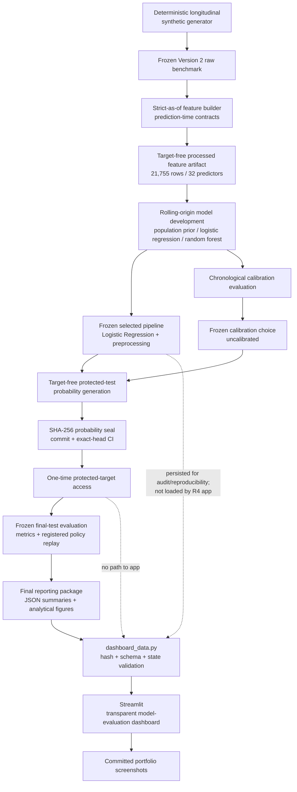

# Version 2 R4 portfolio architecture

## Purpose

This diagram summarizes the Version 2 evidence flow from the synthetic
longitudinal benchmark through model development, one-time protected
evaluation, frozen reporting, and the read-only Streamlit portfolio layer.

It also makes the deployment boundary explicit: the R4 application has no
runtime path from user input to model inference and no path to protected target
access.

## Architecture



## Application boundary

The Streamlit layer may read only committed, already-opened R3 reporting
artifacts and approved analytical figures.

It must not:

- invoke the protected-target accessor;
- regenerate protected-test probabilities;
- load the persisted model for appointment scoring;
- accept patient/appointment inputs for individualized inference;
- expose a user-adjustable operating threshold;
- refit or recalibrate the model; or
- change features, hyperparameters, or application behavior in response to the
  protected final-test outcomes.

## Evidence-based app decision

The pre-frozen R3 gate required all four conditions to pass before an
appointment-level risk demonstration could be authorized.

The protected final test passed the Average Precision, ROC-AUC, and log-loss
conditions but failed the Brier no-worse-than-prior condition. The resulting
R4 application type is therefore:

```text
transparent_model_evaluation_dashboard
```

This is a presentation and audit surface for the synthetic benchmark, not a
clinical or operational prediction product.
